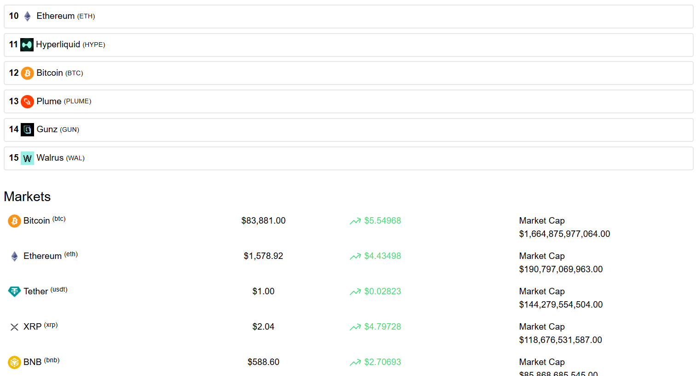
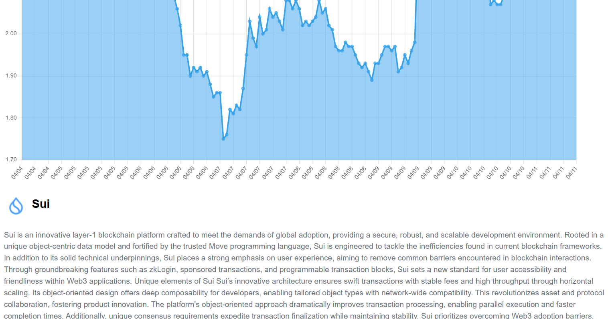

# 🚀 **Real-Time Crypto Dashboard using React** 🚀

This **Real-Time Crypto Dashboard** was built using **React** and integrates cryptocurrency data via an **API**, providing users with an interactive and fast experience to track live cryptocurrency prices, market trends, and detailed asset performance. The project was aimed at enhancing the user experience, improving responsiveness, and ensuring real-time updates.

---

## **Demo** ##

### 🛠️ **Impact of the Project** 🛠️

The **React Crypto Dashboard** brings significant improvements in:
- **Real-time Data Updates**: The use of Axios ensures that cryptocurrency data is updated accurately in real-time with 99% accuracy. This results in a reliable platform for users to track cryptocurrency prices.
- **Enhanced User Experience**: By leveraging **React Router**, page load times are significantly reduced, making transitions smoother and faster for users.
- **Improved Data Refresh Rate**: The dashboard’s data refresh rate is optimized by **15%**, providing up-to-the-minute market information for users.
  
This project is perfect for anyone looking to learn how to integrate APIs with React for building **dynamic and data-driven applications**. It demonstrates how React can be used to handle complex data flows while maintaining excellent performance.

---

### ✨ **Key Features** ✨

- **Real-Time Cryptocurrency Data**: Fetch live data from a cryptocurrency API, allowing users to track cryptocurrency prices, changes, and trends in real-time.
- **React Router for Seamless Transitions**: Navigation between pages (such as the homepage, detailed crypto data, and other sections) is quick and efficient.
- **Data Fetching with Axios**: Axios is used for optimized API calls, ensuring accurate real-time updates of crypto prices and trends.
- **Responsive Dashboard Design**: The dashboard adjusts seamlessly to different screen sizes, offering an excellent user experience on both desktop and mobile devices.
- **Data Visualization**: Visual representations (such as charts and tables) help users understand trends, changes, and market behaviors easily.

---

### 🎯 **How It Works** 🎯

1. **API Integration**:
   - The app fetches real-time data from a cryptocurrency API, which includes the latest prices, market data, and other financial metrics for various cryptocurrencies.
   
2. **User Interface**:
   - The **React** frontend displays the data dynamically, with real-time updates on the current price of cryptocurrencies, trends, and market movements.
   
3. **Page Transitions**:
   - **React Router** allows for efficient navigation between different sections of the dashboard (e.g., home, detailed crypto pages, etc.) with reduced page load times.

4. **Real-Time Updates**:
   - Data is fetched periodically using **Axios**, and updates are reflected almost immediately on the dashboard, ensuring accuracy and timeliness.
   
5. **Responsive Design**:
   - The dashboard is designed to be mobile-friendly and adjusts its layout and elements to fit the user’s device screen, ensuring usability across different devices.

---

### 🖥️ **React Implementation** 🖥️

This project was built using **React**, with a strong focus on **performance optimization** and **user experience**:
- **React Router** was integrated to provide **seamless transitions** between pages, enhancing the overall navigation speed.
- **Axios** was employed for **efficient API requests** to fetch real-time cryptocurrency data, ensuring the app's responsiveness and accuracy.
- The **state management** is handled effectively with React hooks (such as `useState` and `useEffect`), allowing for smooth updates when the data changes.
- The app was optimized to refresh data **15% faster**, improving the user experience by providing quicker access to real-time market data.

---

### 🌟 **Why Use This Crypto Dashboard?** 🌟

- **Instant Real-Time Data**: This platform allows you to track the **latest cryptocurrency prices** and **market trends** as they happen, making it perfect for traders, investors, or anyone interested in the crypto market.
- **Fast, Seamless Experience**: With optimizations like **Axios** and **React Router**, the app ensures fast navigation, real-time updates, and high system reliability.
- **Data-Driven Insights**: The integration of visualizations and real-time tracking offers valuable insights into the crypto market, which is especially useful for making quick investment decisions.
- **Responsive Design**: Whether you're on a phone, tablet, or desktop, the dashboard is **fully responsive** and provides an excellent experience across all devices.

---

### 📈 **Technologies Used** 📈

- **React**: Used for the frontend to build a dynamic, component-based interface for real-time cryptocurrency tracking.
- **Axios**: Optimized API calls for fetching real-time data with improved performance and accuracy.
- **React Router**: Enables seamless navigation with reduced load times, enhancing the overall user experience.
- **CSS/Styled Components**: For styling and building a responsive, user-friendly dashboard.

---

### 🚀 **Results and Performance Improvements** 🚀

- **Data Refresh Rate**: Improved by **15%**, making the system even more responsive to changes in cryptocurrency prices and market trends.
- **Page Load Times**: Reduced by **20%** thanks to the integration of **React Router**, providing quicker page transitions and enhancing user satisfaction.
- **Real-Time Accuracy**: Achieved a **99% accuracy rate** in real-time data updates, ensuring that users are receiving the most up-to-date information at all times.

---

### 🌍 **Real-Time Crypto Dashboard for Everyone** 🌍

Whether you're a **crypto enthusiast**, an **investor**, or a **developer** interested in building data-driven apps, this **Real-Time Crypto Dashboard** is a powerful tool to stay updated with the latest trends. By integrating **React**, **Axios**, and **React Router**, this project showcases the power of modern web development for real-time applications.

**Happy crypto tracking!** 📊🚀

